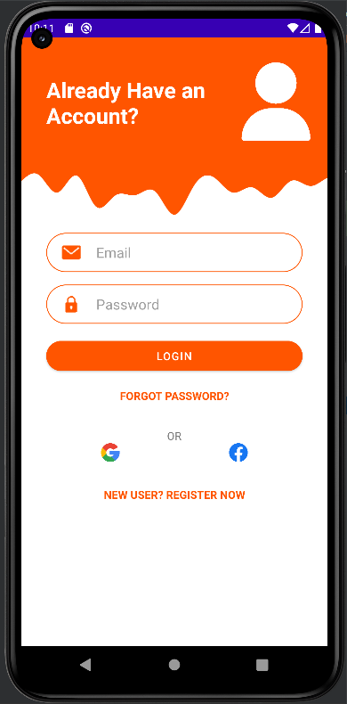
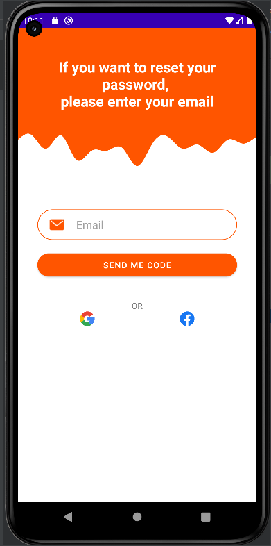

МИНИСТЕРСТВО НАУКИ И ВЫСШЕГО ОБРАЗОВАНИЯ
РОССИЙСКОЙ ФЕДЕРАЦИИ
ФЕДЕРАЛЬНОЕ ГОСУДАРСТВЕННОЕ БЮДЖЕТНОЕ
ОБРАЗОВАТЕЛЬНОЕ УЧРЕЖДЕНИЕ ВЫСШЕГО ОБРАЗОВАНИЯ
«САХАЛИНСКИЙ ГОСУДАРСТВЕННЫЙ УНИВЕРСИТЕТ»

      

Институт естественных наук и техносферной безопасности Кафедра информатики Чагочкин Никита

   

Лабораторная работа №9 «Создание интерфейсов с использованием макетов и виджетов».
 01.03.02 Прикладная математика и информатика

            

Научный руководитель 
Соболев Евгений Игоревич

   

г. Южно-Сахалинск 2023 г.

***
# 
Задание 

Необходимо реализовать макет по изображению, соблюдая отступы согласно рисунку.Реализовать простую авторизацию по логину паролю, при удачной попытке вывести пользователю сообщение об авторизации, если пароль логин неверный, то сообщение об ошибке. Сделать вторую Activity для восстановления пароля в стилистике рисунка 1, также сделать переход с главной Activity на вторую.

***
# 
Решение 

## 
Email: nikitaklik300@gmail.com 

## 
Password: 1234 

## 
XML

            <?xml version="1.0" encoding="utf-8"?>
    <RelativeLayout xmlns:android="http://schemas.android.com/apk/res/android"
    xmlns:app="http://schemas.android.com/apk/res-auto"
    xmlns:tools="http://schemas.android.com/tools"
    android:layout_width="match_parent"
    android:layout_height="match_parent"
    android:orientation="vertical"
    >

    <LinearLayout
        android:id="@+id/header"
        android:layout_width="match_parent"
        android:layout_height="150dp"
        android:orientation="horizontal"
        android:background="#FF5500">

        <TextView
            android:id="@+id/textView"
            android:layout_width="wrap_content"
            android:layout_height="wrap_content"
            android:text="Already Have an \nAccount?"
            android:layout_marginTop="48dp"
            android:layout_marginLeft="32dp"
            android:textColor="@color/white"
            android:textSize="28dp"
            android:textStyle="bold"
            android:layout_weight="4"/>

        <ImageView
            android:id="@+id/Header_imageView"
            android:layout_width="100dp"
            android:layout_height="100dp"
            android:layout_marginEnd="16dp"
            app:srcCompat="@drawable/user"
            android:layout_marginTop="32dp"
            />
    </LinearLayout>

    <ImageView
        android:id="@+id/wave"
        android:layout_width="match_parent"
        android:layout_height="100dp"
        android:layout_below="@id/header"

        android:scaleType="centerCrop"
        app:srcCompat="@drawable/wave2" />

    <LinearLayout
        android:id="@+id/email_linear"
        android:layout_width="match_parent"
        android:layout_height="50dp"
        android:orientation="horizontal"
        android:layout_below="@id/wave"
        android:background="@drawable/rounded_linear"
        android:layout_marginRight="32dp"
        android:layout_marginLeft="32dp">
        <ImageView
            android:id="@+id/imageViewEmail"
            android:layout_width="24dp"
            android:layout_height="24dp"
            app:srcCompat="@drawable/email_24"
            android:layout_margin="20dp"
            android:layout_gravity="center_vertical"/>
        <EditText
            android:id="@+id/emailText"
            android:inputType="text"
            android:layout_width="match_parent"
            android:layout_height="match_parent"
            android:background="@android:color/transparent"
            android:hint="Email"
            android:textSize="18dp"
            android:textColor="#a0a0a0"
            android:textColorHint="#a0a0a0"/>

    </LinearLayout>

    <LinearLayout
        android:id="@+id/password_linear"
        android:layout_width="match_parent"
        android:layout_height="50dp"
        android:orientation="horizontal"
        android:layout_below="@id/email_linear"
        android:background="@drawable/rounded_linear"
        android:layout_marginRight="32dp"
        android:layout_marginLeft="32dp"
        android:layout_marginTop="16dp">
        <ImageView
            android:id="@+id/imageViewPassword"
            android:layout_width="24dp"
            android:layout_height="24dp"
            app:srcCompat="@drawable/lock"
            android:layout_margin="20dp"
            android:layout_gravity="center_vertical"/>
        <EditText
            android:id="@+id/passwordText"
            android:inputType="textPassword"
            android:layout_width="match_parent"
            android:layout_height="match_parent"
            android:background="@android:color/transparent"
            android:hint="Password"
            android:textSize="18dp"
            android:textColor="#a0a0a0"
            android:textColorHint="#a0a0a0"/>

    </LinearLayout>

    <Button
        android:id="@+id/button"
        android:layout_width="match_parent"
        android:layout_height="50dp"
        android:layout_below="@id/password_linear"
        android:layout_marginLeft="32dp"
        android:layout_marginTop="16dp"
        android:layout_marginRight="32dp"
        android:backgroundTint="#FF5500"
        android:text="LOGIN"
        app:cornerRadius="30dp" />

    <TextView
        android:id="@+id/textView3"
        android:layout_width="match_parent"
        android:layout_height="wrap_content"
        android:layout_below="@id/button"
        android:text="FORGOT PASSWORD?"
        android:layout_marginLeft="32dp"
        android:layout_marginTop="16dp"
        android:layout_marginRight="32dp"
        android:textColor="#FF5500"
        android:textStyle="bold"
        android:textAlignment="center"
        />

    <TextView
        android:id="@+id/textView5"
        android:layout_width="wrap_content"
        android:layout_height="wrap_content"
        android:text="OR"
        android:layout_below="@id/textView3"
        android:layout_marginTop="32dp"
        android:layout_centerHorizontal="true"/>

    <LinearLayout
        android:id="@+id/google_facebook"
        android:layout_width="match_parent"
        android:layout_height="wrap_content"
        android:orientation="horizontal"
        android:layout_below="@id/textView5"
        android:layout_marginLeft="32dp"
        android:layout_marginRight="32dp">

        <ImageView
            android:id="@+id/imageView"
            android:layout_width="match_parent"
            android:layout_height="24dp"
            app:srcCompat="@drawable/google"
            android:layout_weight="1"/>
        <ImageView
            android:id="@+id/imageView2"
            android:layout_width="match_parent"
            android:layout_height="24dp"
            app:srcCompat="@drawable/fb"
            android:layout_weight="1"/>

    </LinearLayout>
    <TextView
        android:id="@+id/textView6"
        android:layout_width="match_parent"
        android:layout_height="wrap_content"
        android:layout_below="@id/google_facebook"
        android:text="NEW USER? REGISTER NOW"
        android:layout_marginLeft="32dp"
        android:layout_marginTop="32dp"
        android:layout_marginRight="32dp"
        android:textColor="#FF5500"
        android:textStyle="bold"
        android:textAlignment="center"
        />

        </RelativeLayout>

## 
XML 2

        <?xml version="1.0" encoding="utf-8"?>
        <RelativeLayout xmlns:android="http://schemas.android.com/apk/res/android"
            xmlns:app="http://schemas.android.com/apk/res-auto"
            xmlns:tools="http://schemas.android.com/tools"
            android:layout_width="match_parent"
            android:layout_height="match_parent"
            android:orientation="vertical"
            >

        <LinearLayout
            android:id="@+id/header"
            android:layout_width="match_parent"
            android:layout_height="150dp"
            android:orientation="horizontal"
            android:background="#FF5500">

            <TextView
                android:id="@+id/textView"
                android:layout_width="wrap_content"
                android:layout_height="wrap_content"
                android:text="If you want to reset your password, \nplease enter your email"
                android:layout_marginTop="48dp"
                android:layout_marginLeft="32dp"
                android:layout_marginRight="32dp"
                android:textColor="@color/white"
                android:textSize="24dp"
                android:textStyle="bold"
                android:layout_weight="4"
                android:textAlignment="center"/>

        </LinearLayout>

        <ImageView
            android:id="@+id/wave"
            android:layout_width="match_parent"
            android:layout_height="100dp"
            android:layout_below="@id/header"

            android:scaleType="centerCrop"
            app:srcCompat="@drawable/wave2" />

        <LinearLayout
            android:id="@+id/email_linear"
            android:layout_width="match_parent"
            android:layout_height="50dp"
            android:orientation="horizontal"
            android:layout_below="@id/wave"
            android:background="@drawable/rounded_linear"
            android:layout_marginRight="32dp"
            android:layout_marginLeft="32dp"
            android:layout_marginTop="48dp">
            <ImageView
                android:id="@+id/imageViewEmail"
                android:layout_width="24dp"
                android:layout_height="24dp"
                app:srcCompat="@drawable/email_24"
                android:layout_margin="20dp"
                android:layout_gravity="center_vertical"/>
            <EditText
                android:id="@+id/emailText"
                android:inputType="text"
                android:layout_width="match_parent"
                android:layout_height="match_parent"
                android:background="@android:color/transparent"
                android:hint="Email"
                android:textSize="18dp"
                android:textColor="#a0a0a0"
                android:textColorHint="#a0a0a0"/>

        </LinearLayout>

        <Button
            android:id="@+id/button"
            android:layout_width="match_parent"
            android:layout_height="50dp"
            android:layout_below="@id/email_linear"
            android:layout_marginLeft="32dp"
            android:layout_marginTop="16dp"
            android:layout_marginRight="32dp"
            android:backgroundTint="#FF5500"
            android:text="Send me code"
            app:cornerRadius="30dp" />
        <TextView
            android:id="@+id/textView5"
            android:layout_width="wrap_content"
            android:layout_height="wrap_content"
            android:text="OR"
            android:layout_below="@id/button"
            android:layout_marginTop="32dp"
            android:layout_centerHorizontal="true"/>

        <LinearLayout
            android:id="@+id/google_facebook"
            android:layout_width="match_parent"
            android:layout_height="wrap_content"
            android:orientation="horizontal"
            android:layout_below="@id/textView5"
            android:layout_marginLeft="32dp"
            android:layout_marginRight="32dp">

            <ImageView
                android:id="@+id/imageView"
                android:layout_width="match_parent"
                android:layout_height="24dp"
                app:srcCompat="@drawable/google"
                android:layout_weight="1"/>
            <ImageView
                android:id="@+id/imageView2"
                android:layout_width="match_parent"
                android:layout_height="24dp"
                app:srcCompat="@drawable/fb"
                android:layout_weight="1"/>

        </LinearLayout>

        </RelativeLayout>
## 
Простая авторизация

                ForgotPassword=findViewById(R.id.textView3)
                ForgotPassword.setOnClickListener {
                    val intent = Intent(this, ForgotPass::class.java)
                    startActivity(intent)
                }
                signin=findViewById(R.id.button)
                login=findViewById(R.id.emailText)
                password=findViewById(R.id.passwordText)
                signin.setOnClickListener {
                    if(login.text.toString()==getString(R.string.true_login)&&password.text.toString()==getString(R.string.true_pass)){
                        Toast.makeText(this,"Sign in completed",Toast.LENGTH_LONG).show()
                    }else{
                        Toast.makeText(this,"Incorrect email or password",Toast.LENGTH_LONG).show()
                    }
                }

## 
Простое востановление пароля

                forgot_button=findViewById(R.id.button)
                login=findViewById(R.id.emailText)
                forgot_button.setOnClickListener{
                    if(login.text.toString()==getString(R.string.true_login)){
                        Toast.makeText(this,"Your pass 1234",Toast.LENGTH_LONG).show()
                    }else{
                        Toast.makeText(this,"Email not found ",Toast.LENGTH_LONG).show()
                    }
                }